# High Plains Drifter v2 — руководство по сборке

## Перед началом

**Собрать клавиатуру своими руками — реально.** Даже если ты никогда не держал паяльник и не знаешь, что такое диод. Это руководство написано так, чтобы каждый шаг был понятен без специальных знаний.

Всё, что нужно — это немного терпения, аккуратность и подготовленные заранее компоненты. Никакой магии.

### Что подготовить до начала

| # | Что сделать |
|---|-------------|
| 1 | **Закупи все компоненты** — список есть ниже в разделе «Компоненты» |
| 2 | **Напечатай корпус** и подготовь детали (зачисти, если нужно) |
| 3 | **Организуй рабочее место** — хорошее освещение, чистая поверхность, паяльник под рукой |
| 4 | **Открой схемы** — они понадобятся в процессе, лучше держать под рукой |

| 📄 Схемы платы | добавить ссылку |
|---|---|
| 📁 Файлы корпуса | добавить ссылку |

| ✅ |
|---|
| Не спеши. Собрать аккуратно с первого раза — лучше, чем переделывать потом. |

---

## Компоненты

| ⚠️ |
|---|
| ⚠️ При заказе учитывай возможность брака — бери на **5–10% больше** нужного количества. Особенно это касается диодов, свитчей и хотсвапов. |

<strong>🧠 Контроллер RP2040-Zero — 2 шт.</strong>

Это мозг клавиатуры. Именно он получает сигнал от каждой клавиши и отправляет его на компьютер. Одна плата на каждую половинку.

Важно не перепутать с другими платами похожего размера — нужен именно **RP2040-Zero**.

*📸 Контроллер RP2040-Zero*

<strong>🔌 USB Type-C разъём — 2 шт.</strong>

Через этот разъём каждая половинка подключается к компьютеру. Нужен вариант на плате-адаптере — так его удобнее паять.

> Для поиска: `USB 3.1 Type-C Female Socket Connector Replacement 16 Pin Test PCB Board Adapter`

*📸 USB Type-C разъём на плате-адаптере*

<strong>⚡ Диоды 1N4148 — 60 шт.</strong>

Диоды нужны, чтобы клавиатура правильно распознавала одновременные нажатия нескольких клавиш. Без них при нажатии нескольких кнопок сразу устройство будет путаться.

Устанавливаются строго в одну сторону — на корпусе есть чёрная полоска, которая указывает правильное направление.

*📸 Диод 1N4148 — анод и катод*

<strong>🔩 Hot-swap сокеты — 60 шт.</strong>

Сокеты позволяют вставлять и вынимать свитчи без пайки. Захотел поменять свитчи — просто вытащил и вставил новые, без паяльника.

Подходят сокеты под **Outemu** или **Gateron**.

<strong>🎹 Свитчи — 60 шт.</strong>

Свитчи — это переключатели под каждой клавишей. Именно они создают ощущение нажатия: щелчок, мягкость или тихость — всё зависит от типа.

Подходят **Outemu** или **Gateron**. Выбирай по вкусу.

*📸 Свитч Outemu Silent Tom*

<strong>🪛 Провода — моток ~0,5 м</strong>

Провода соединяют контроллер со свитчами и USB-разъёмом. Удобнее использовать разноцветные — легче не запутаться при пайке.

Длину каждого провода подбирай по месту: он должен свободно достигать нужного пина без натяга.

<strong>🔬 Резисторы от 1 до 100 кОм — 2 шт.</strong>

Маленький компонент, который помогает контроллеру понять, какая это половинка — левая или правая. Без него клавиатура не сможет правильно определить свою роль при подключении.

Подходит любой резистор в диапазоне **1–100 кОм**, например **CFR-25JT-52-10K**.

*📸 Резистор — вид стандартного CFR-25JT-52-10K*

<strong>🔩 Винт М3×5 — 10 шт.</strong>

Стандартные крепёжные винты для сборки корпуса. Подходят для соединения верхней и нижней части корпуса.

*📸 Винт М3×5 — вид спереди и сбоку*

<strong>🔧 Термовставки М3 — 10 шт.</strong>

Термовставки вплавляются в корпус при помощи паяльника и создают надёжную резьбу в пластике для крепёжных винтов. Это стандартный способ крепления для 3D-печатных корпусов.

*📸 Термовставки М3 — латунные*

---

## Инструменты

Для сборки тебе понадобится стандартный набор. Ничего специализированного — всё это есть в любом магазине инструментов.

| Инструмент | Для чего нужен |
|------------|----------------|
| 🔧 Паяльник | Пайка всех соединений. Температура — до 285°C |
| 🧲 Пинцет | Удержание деталей при пайке |
| ✂️ Кусачки / бокорезы | Обрезка ног диодов |
| 🔩 Отвёртка | Закручивание винтов M3x5 при сборке корпуса |

---

## Порядок сборки

Ниже будет собираться пошаговое руководство по сборке.  
У каждого пункта можно раскрыть описание и посмотреть изображения.

<strong>🏗️ Подготовка корпуса</strong>

После распечатки корпуса на 3D-принтере нужно подготовить его к сборке — это займёт совсем немного времени, но сделает итоговый результат аккуратным.

**Шаг 1 — Зачистка от поддержек**

Удали все поддержки и наплывы от печати. Используй кусачки, нож или наждачную бумагу. Главное — чтобы поверхности были ровными и ничего не мешало установке свитчей и крышки.

**Шаг 2 — Впайка втулок**

| ⚠️ |
|---|
| Температура паяльника для впайки втулок — **не более 285°C**. Перегрев разрушит пластик вокруг отверстия. |

Поставь втулку на отверстие в корпусе, приложи разогретый паяльник сверху и плавно вдавли втулку заподлицо. Не давить резко — она должна войти ровно, без перекоса.

<a href="images/heat-insert-closeup.jpg">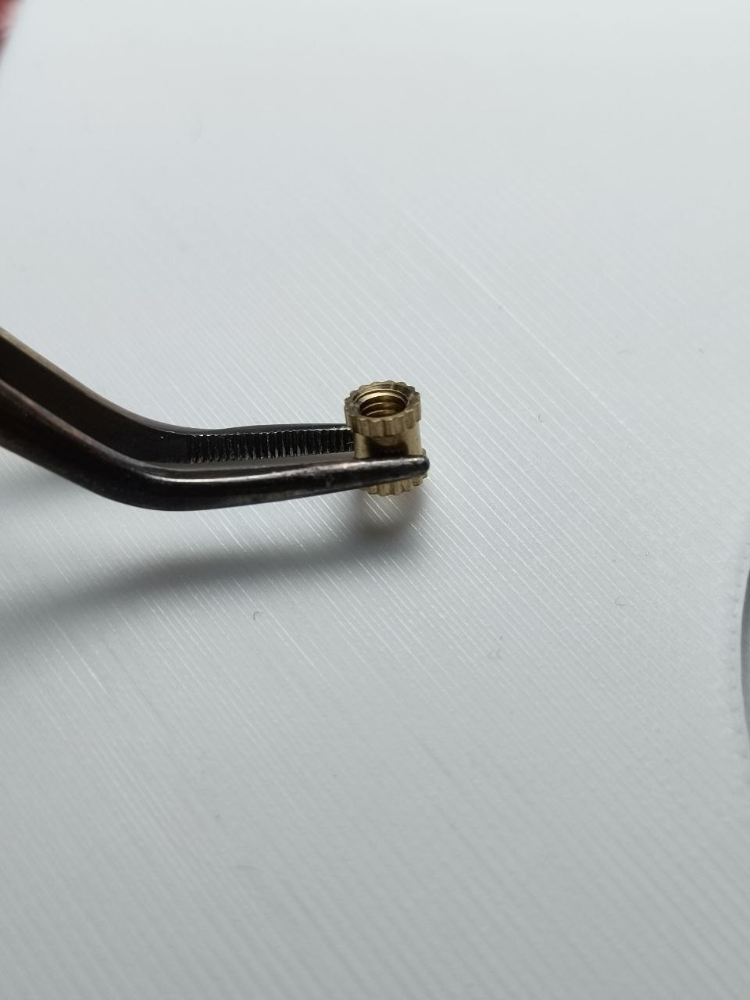</a>

*📸 Термовставка М3 — вид крупным планом*

*📸 Впайка втулки в корпус пинцетом*

*📸 Корпус со всеми впаянными втулками*

**Проверка правильности установки**

| ✅ |
|---|
| Приложи крышку корпуса поверх основания. Если все отверстия совпадают — отлично, можно двигаться дальше. Если нет — слегка разогрей паяльником нужную втулку и пинцетом или зубочисткой скорректируй её положение. |

<strong>1. Подготовка перед пайкой</strong>

Прежде чем брать паяльник — нужно разобраться с диодами и расставить всё по местам.

**Диод** — маленькая деталь с двумя ногами: **анодом** и **катодом**. Сторона с чёрной полоской — катод. Это важно: если поставить диод задом наперёд, клавиша не будет работать.

<a href="images/trimmed-diode-legs-new.jpg">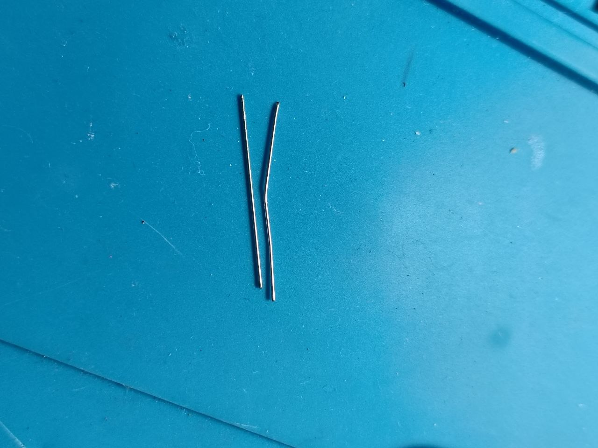</a>

*📸 Диоды 1N4148 с обрезанными ножками*

*📸 Диоды 1N4148 с подогнутой ногой*

1. У каждого диода **обрежь ногу анода**, оставив примерно **5–10 мм**. Это перемычка — она понадобится на следующем шаге.
2. **Не выбрасывай** обрезанные кусочки — сложи их отдельно.
3. **Вставь свитчи** в корпус.
4. Надень **hot-swap сокеты** на контакты свитчей снизу — аккуратно, до фиксации.

<a href="images/prep-1.png">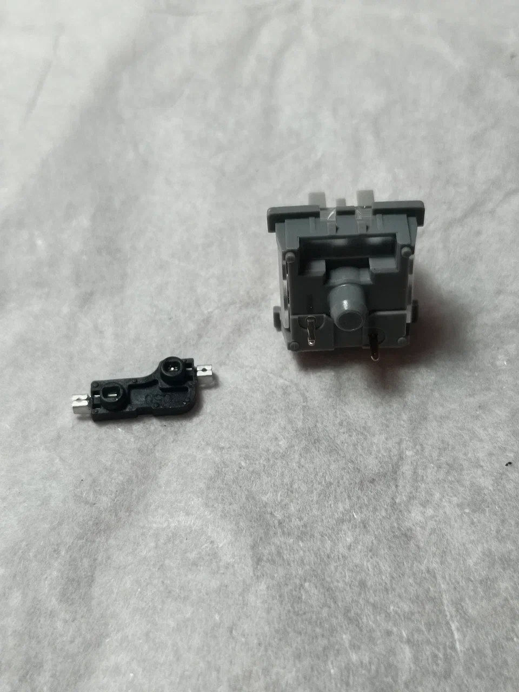</a>

*📸Hot-swap сокет и свитч — до установки*

*📸Свитчи вставлены в корпус*

<a href="images/prep-3.png">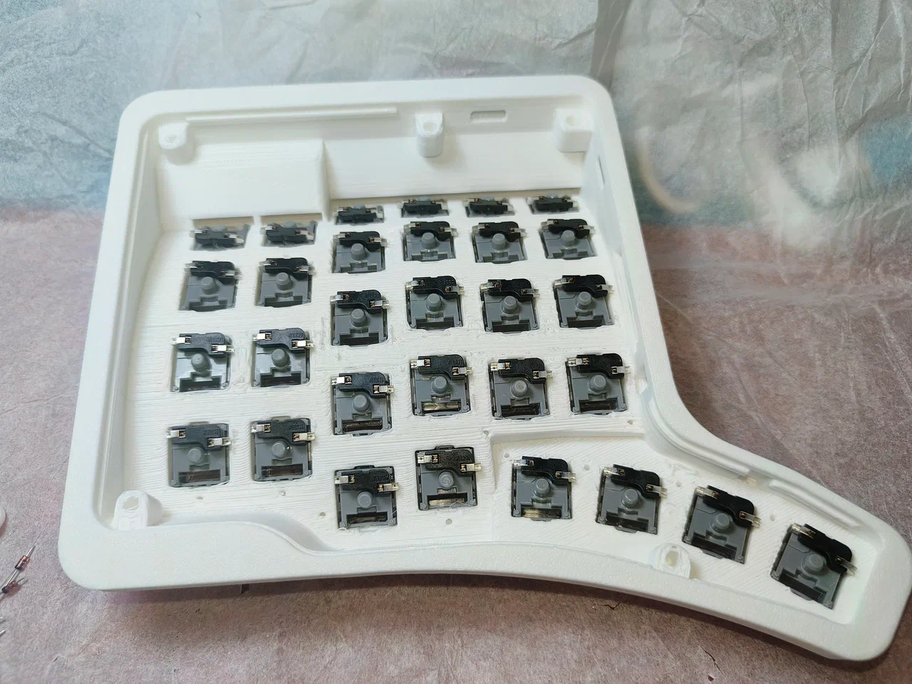</a>

*📸Сокеты надеты на свитчи — готово к пайке*

<strong>2. Пайка столбцов и строк</strong>

Сейчас соединяем все hot-swap сокеты между собой — сначала по столбцам, потом по строкам. Именно так клавиатура «понимает», какая клавиша нажата.

1. **Залуди контакты** на hot-swap сокетах — нанеси немного припоя, чтобы соединения держались надёжно.
2. К **левому контакту** каждого сокета припаяй **заготовленные кусочки от анодов**, двигаясь сверху вниз по столбцу.
3. Припаяй сами **диоды**.
4. Обрезанный остаток ноги диода **подогни на 90°** и припаяй к **правому контакту** того же сокета. Второй конец оставь торчать в воздухе.
5. Двигаясь по строке **справа налево**, соединяй диоды так же.
6. Торчащие ноги **загни навстречу друг другу и спаяй между собой** — так замыкается строка. Больше никуда их не подключай.

| ⚠️ |
|---|
| ⚠️ На последнем фото показан ключевой момент — как именно соединяются катоды. Посмотри перед пайкой. |

<a href="images/columns-rows-1.png">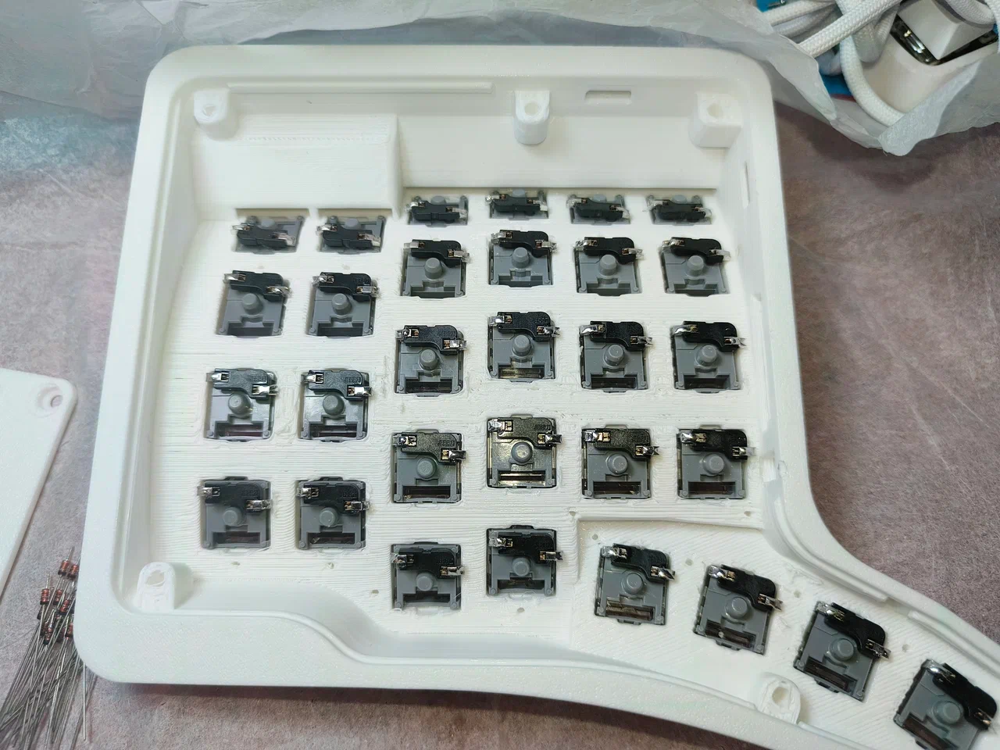</a>

*📸Залуженные сокеты — готовы к пайке столбцов*

*📸Штырьки от диодов припаяны к левым контактам сокетов*

<a href="images/columns-rows-3.png">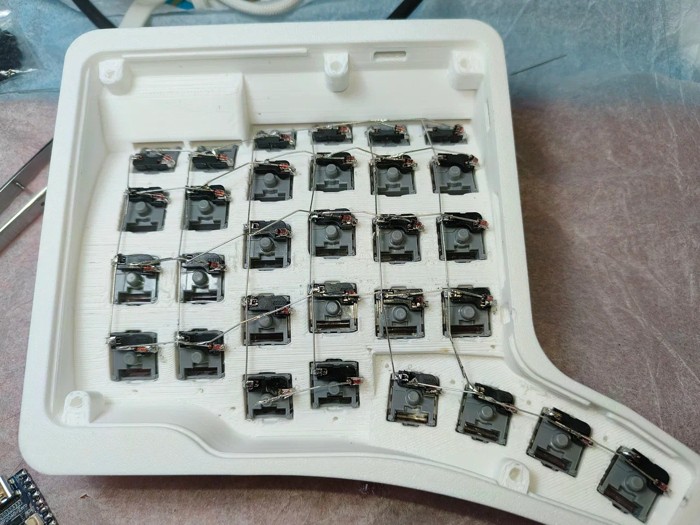</a>

*📸Диоды припаяны по строкам справа налево*

<a href="images/columns-rows-4.png">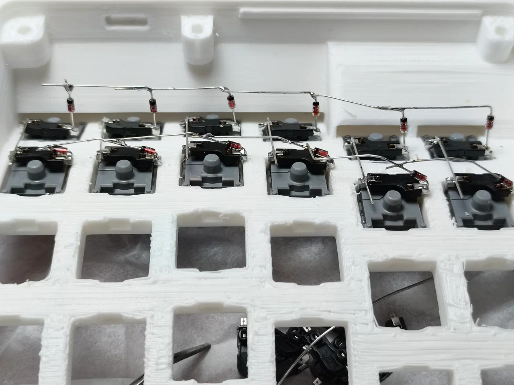</a>

*📸Катоды соединены между собой — строка замкнута*

<strong>3. Пайка контроллера RP-ZERO</strong>

RP2040-Zero — это маленькая плата, которая является мозгом клавиатуры. Её задача — получать сигнал от каждой клавиши и отправлять его на компьютер.

Сейчас нужно соединить её проводами с хотсвап-сокетами и USB-разъёмом. Звучит пугающе, но всё устроено просто: у каждого провода есть конкретное место — пин на плате. Пины пронумерованы на схеме, просто следуй ей шаг за шагом.

#### Столбцы (вертикальные линии клавиш)

| ⚠️ |
|---|
| ⚠️ Отсчёт столбцов всегда начинается со стороны отверстия для USB. |

Каждый столбец — это вертикальная линия клавиш. От любого сокета в этом столбце возьми провод от **левого контакта** и припаяй его к соответствующему пину RP-ZERO по таблице:

| Пин RP-ZERO | Столбец |
|-------------|---------|
| 28          | 1       |
| 27          | —       |
| 26          | —       |
| 15          | 2       |
| 14          | 3       |
| 13          | 4       |
| 12          | 5       |
| 11, 10, 9, 8 | —      |
| 7           | 6       |

#### Ряды (горизонтальные линии клавиш)

| ⚠️ |
|---|
| ⚠️ Отсчёт рядов — всегда сверху вниз. |

| Пин RP-ZERO | Ряд |
|-------------|-----|
| 6           | 1   |
| 5           | 2   |
| 4           | 3   |
| 3           | 4   |
| 2           | 5   |

#### Подключение USB

Теперь подключаем USB-разъём — через него клавиатура будет общаться с компьютером. Важный момент: у левой и правой половинок провода D− и D+ **меняются местами**. Не перепутай — иначе половинка не определится.

**Левая половинка:**

| USB контакт | Пин RP-ZERO |
|-------------|-------------|
| VCC         | 5V          |
| GND         | GND         |
| D−          | 0           |
| D+          | 1           |

**Правая половинка:**

| USB контакт | Пин RP-ZERO |
|-------------|-------------|
| VCC         | 5V          |
| GND         | GND         |
| D−          | 1           |
| D+          | 0           |

#### Резистор

Последний шаг — небольшой резистор. Он помогает компьютеру понять, какую половинку он видит: левую или правую. Без него обе половинки будут вести себя одинаково, и клавиатура не будет работать правильно.

- **Левая половинка:** один конец → пин **3V3**, другой → пин **29**
- **Правая половинка:** один конец → пин **GND**, другой → пин **29**

| ⚠️ |
|---|
| ⚠️ Важно: подбирай длину проводов так, чтобы RP-ZERO свободно двигалась и переворачивалась в корпусе в пределах отверстия для USB. Если провода окажутся короткими и натянутыми — они могут оборваться при сборке корпуса. |

<a href="images/rp-zero-pinout.png">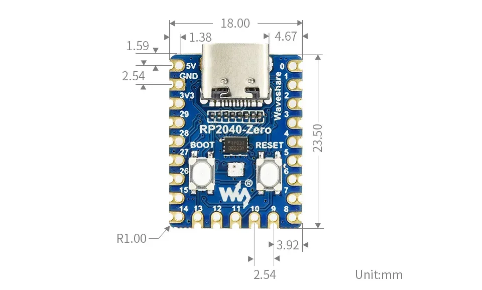</a>

*📸Распиновка RP2040-Zero — какой пин за что отвечает*

*📸Первые провода припаяны к контроллеру*

*📸Все провода столбцов и рядов подключены*

<a href="images/rp-zero-installed.png">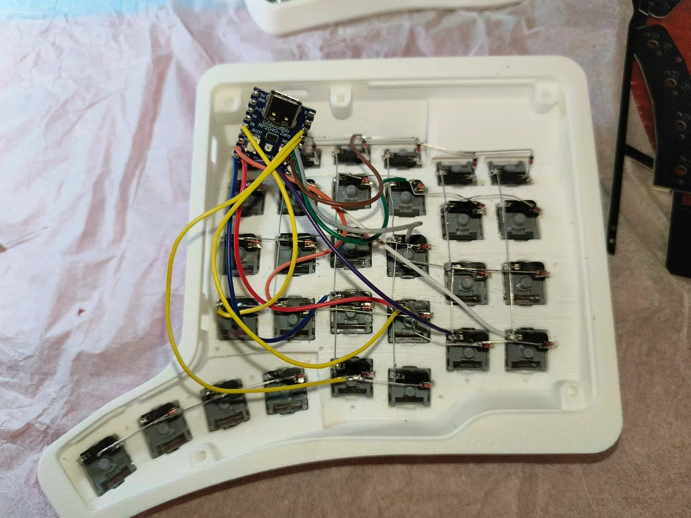</a>

*📸Контроллер размещён в корпусе*

*📸USB Type-C адаптер до подключения проводов*

<a href="images/usb-c-wires.png">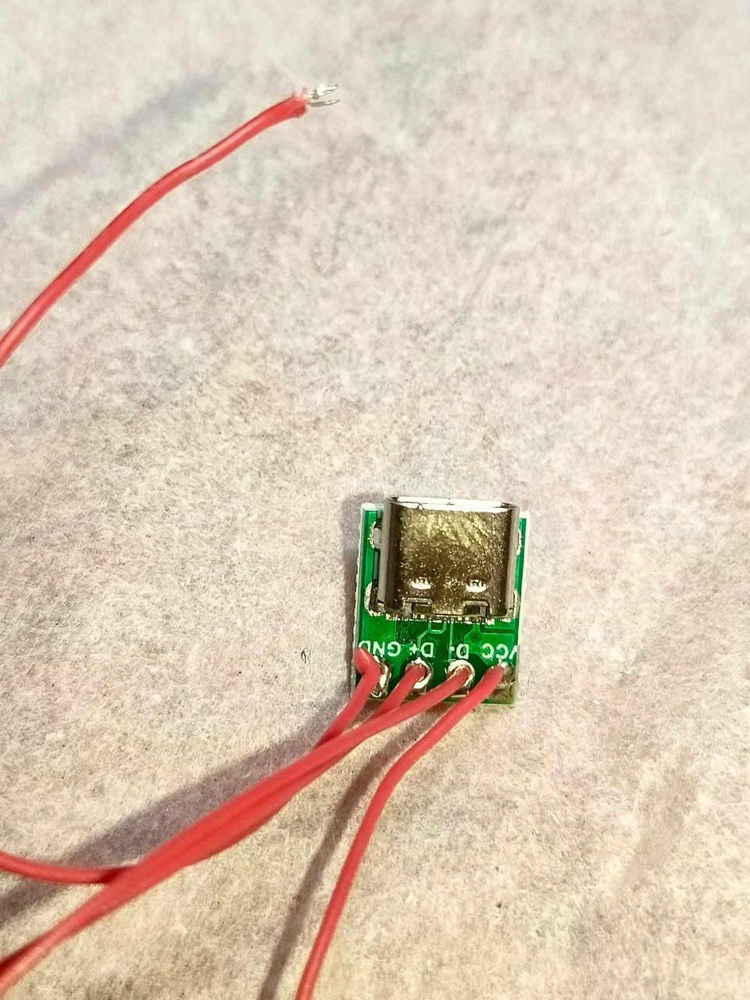</a>

*📸Провода VCC, GND, D−, D+ припаяны к USB адаптеру*

<a href="images/usb-c-rp-zero-connected.png">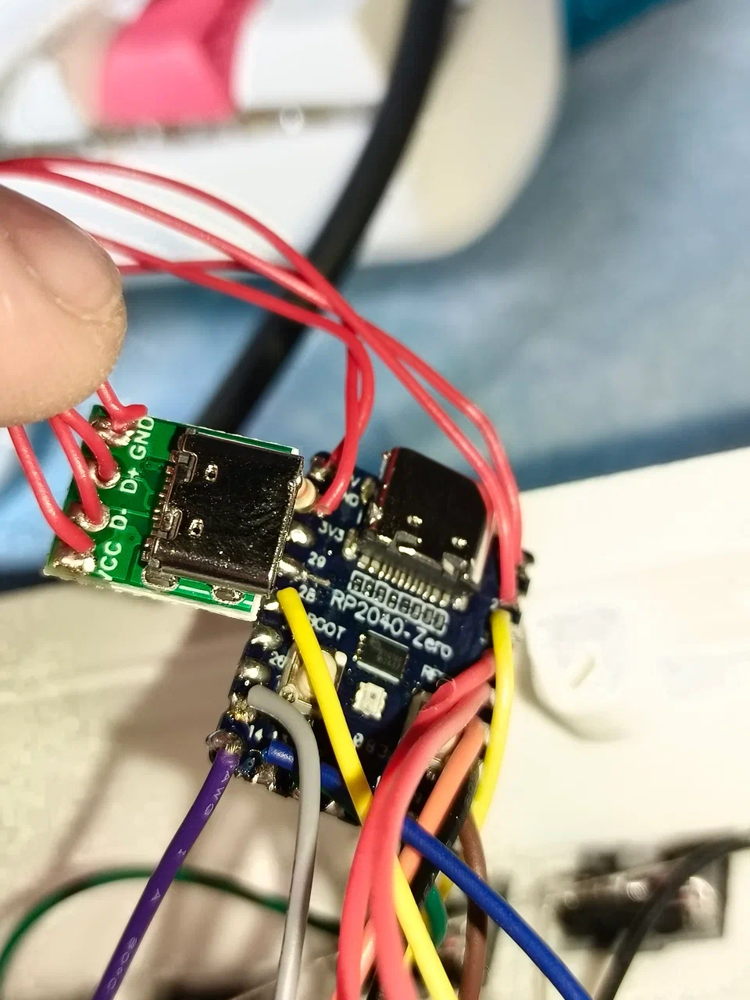</a>

*📸USB адаптер подключён к RP-ZERO*

<a href="images/rp-zero-resistor-complete.png">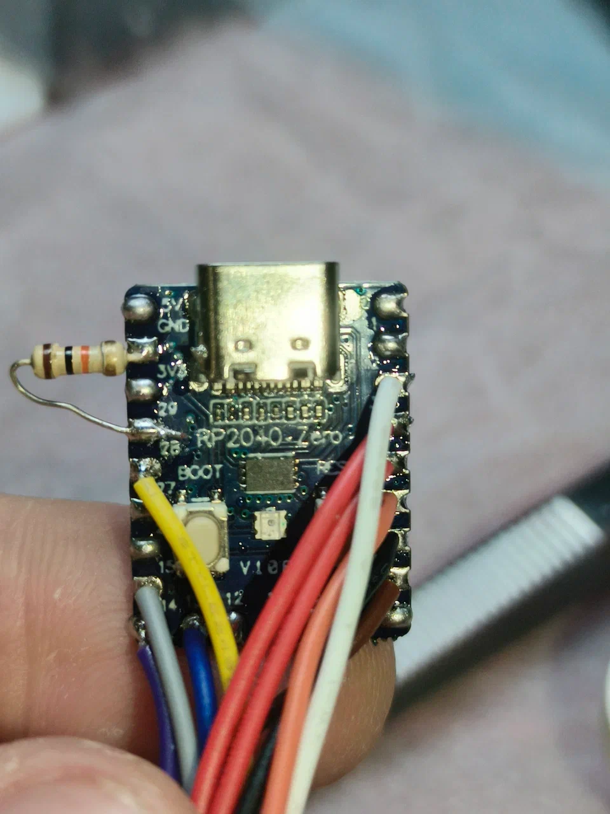</a>

*📸Готово: резистор и все провода на месте*

<strong>4. Установка контроллера в корпус</strong>

Контроллер RP-ZERO устанавливается на специальную напечатанную форму-держатель, которая фиксирует его внутри корпуса.

1. Вставь контроллер в держатель. Он может входить туго — это нормально. Двигай аккуратно, не торопись, чтобы не повредить провода.
2. Убедись, что **провода торчат вверх** — так ты сможешь визуально проверить их целостность после установки.

| ⚠️ |
|---|
| **Не паяй провода к контроллеру, когда он уже установлен в держатель.** Нагрев может деформировать пластик держателя, и крышка не закроется. Все пайки — до установки. |

<a href="images/controller-holder-empty.jpg">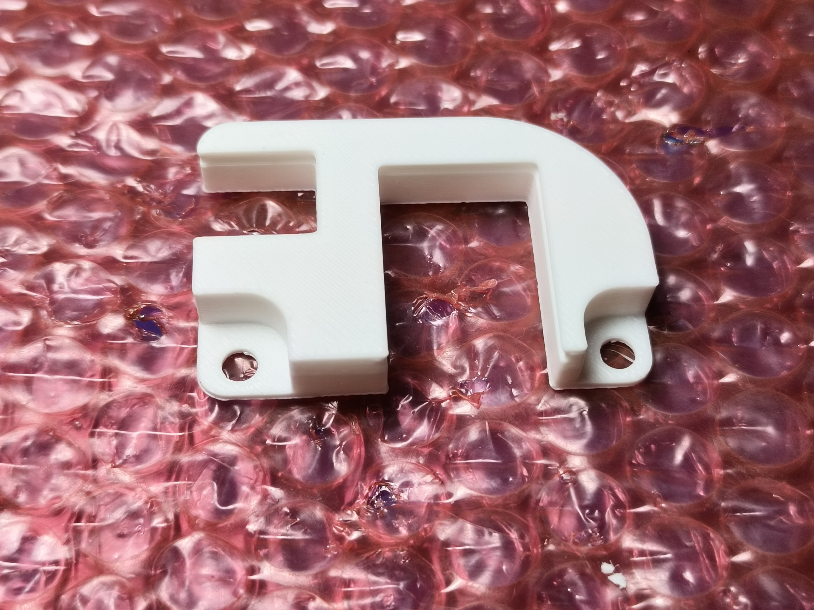</a>

*📸 Форма-держатель для контроллера*

<a href="images/controller-holder-parts.jpg">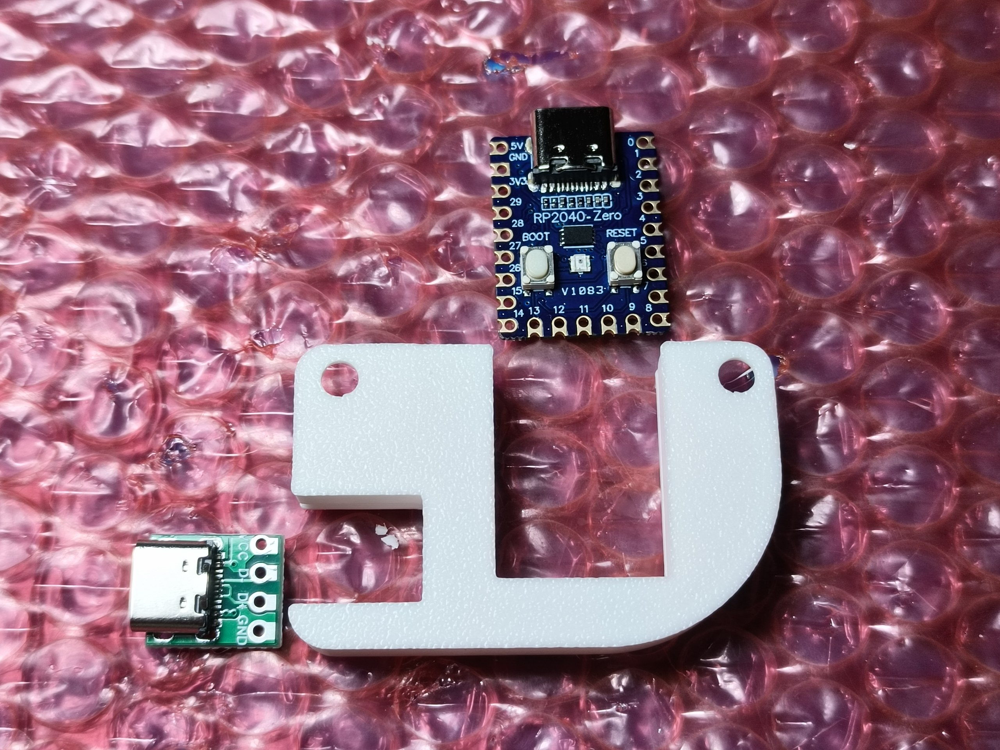</a>

*📸 Контроллер и USB-адаптер перед установкой*

*📸 Контроллер установлен в держатель*

---

**Закрываем корпус**

Уложи провода внутри, установи держатель с контроллером в корпус и закрой крышку.

Закручивай винты **без перетяга** — крышка должна лечь ровно. Небольшие провалы крышки в нижней части корпуса — это **нормально**.

<a href="images/keyboard-wired-open.jpg">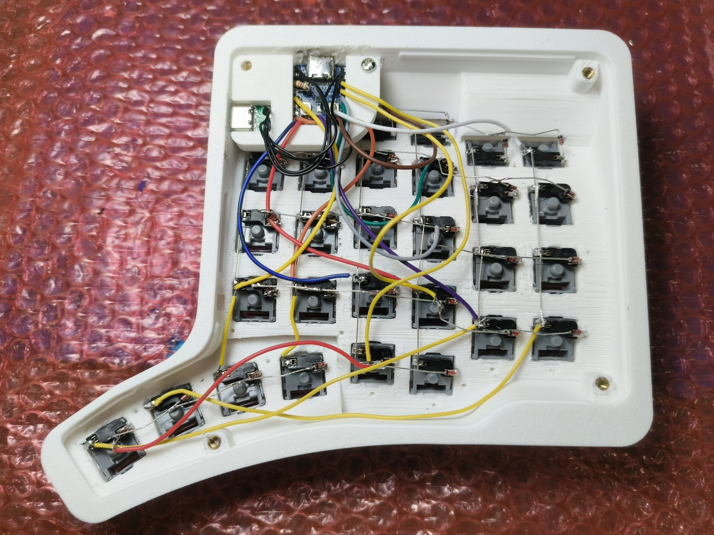</a>

*📸 Корпус с проводами — вид изнутри перед закрытием*

*📸 Собранная клавиатура — вид снизу*

<strong>5. Проверка работоспособности</strong>

Это самый важный шаг перед окончательной сборкой. Лучше убедиться, что всё работает, пока корпус ещё открыт — так проще найти и исправить ошибку.

1. Подключи каждую половинку к компьютеру по USB. Пока это просто тест — класть в корпус и закрывать ничего не нужно, всё «навесу».
2. Прошей каждую половинку актуальной прошивкой с [keymap_hub](https://github.com/ergohaven/keymap_hub).
3. Запусти **[Vial](https://get.vial.today/)** → перейди в **Matrix Tester** и нажимай клавиши по одной.

Каждое нажатие должно подсвечиваться в интерфейсе. Если какая-то клавиша не реагирует — не закрывай корпус, разберись сейчас.

Если все клавиши работают — отлично, можно двигаться дальше.

<a href="images/firmware-test-bare.jpg">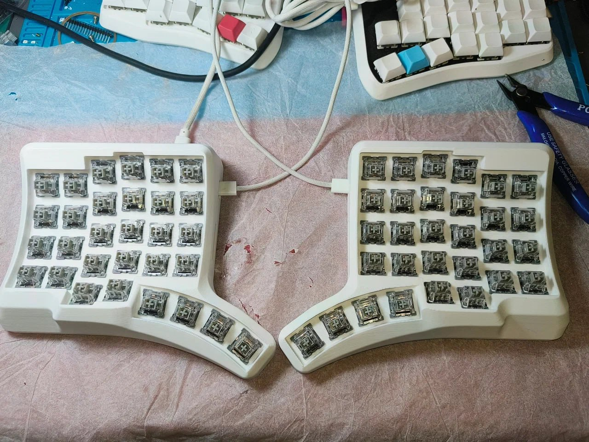</a>

*📸Обе половинки без кейкапов — готовы к тесту*

<a href="images/firmware-test-wired.jpg">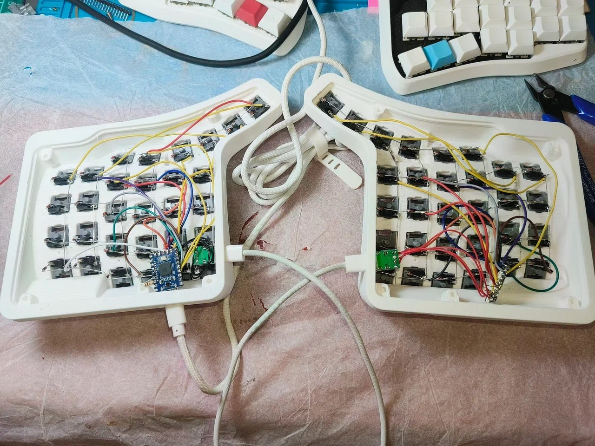</a>

*📸Подключено к компьютеру — идёт проверка клавиш*

---

## Проверка после сборки

Прежде чем закрыть корпус — убедись, что всё в порядке.

| # | Что проверить |
|---|---------------|
| ✅ | Корпус собран ровно, крышка закрывается без усилий и перекосов |
| ✅ | Все соединения надёжны — провода не болтаются, сокеты сидят плотно |
| ✅ | Внутри корпуса ничего не болтается и не мешает закрытию |
| ✅ | Устройство определяется компьютером при подключении |
| ✅ | Все клавиши работают корректно в Matrix Tester (Vial) |

---

## 🎉 Готово!

Ты только что собрал **High Plains Drifter v2** своими руками. Это непросто, но у тебя получилось.

Подключай клавиатуру — и в бой. Если что-то работает не так, в разделе ниже найдёшь решения.

---

## 🛠️ Возможные ошибки

| Проблема | Решение |
|----------|---------|
| 🔌 Компьютер не видит клавиатуру, нет BOOT-диска | Проверь пины 3V3, 5V и GND на короткое замыкание. Проверь целостность USB-разъёма и пайку к нему |
| 📍 Не работает целый столбец | Нет связи между столбцом и RP-ZERO. Проверь провод от левого контакта hot-swap до нужного пина контроллера |
| 📍 Не работает строка или часть строки | Проблема в диодах — перевёрнуты или не припаяны. Проверь ориентацию и качество пайки |
| 🔒 Залипают клавиши | Диод замыкает на столбец. Осмотри пайку диодов в проблемной зоне |
| 🔄 Половинки отзеркалены | Резисторы перепутаны. Левая половинка: резистор на 3V3. Правая: резистор на GND |
| 🔌 Одна из половинок не работает | Проверь пайку проводов на USB-разъёме контроллера. Возможно, провод D+ или D− отвалился или припаян неправильно |
