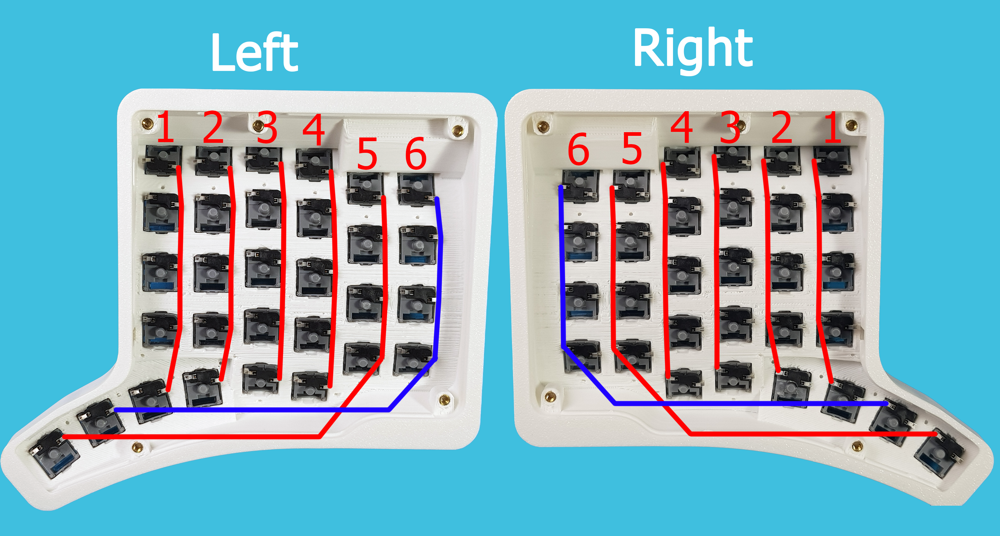
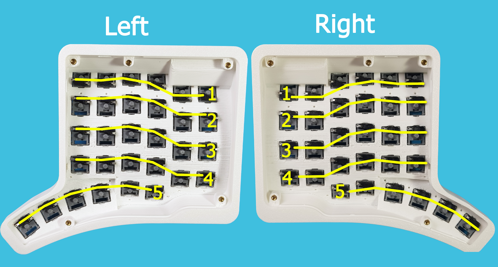

# High Plains Drifter v2 — руководство по ручной сборке клавиатуры

## Перед началом

В данном руководстве описан процесс сборки клавиатуры High Plains Drifter v2 без применения печатных плат и сложной пайки. Руководство ориентировано на тех пользователей, у кого есть желание собрать изогнутую сплит-клавиатуру HPDv2 в домашних условиях и с минимальными затратами на компоненты и инструменты.

> ⚠️ В данном руководстве не затронута сборка модулей для клавиатуры HPDv2, так как навесной монтаж компонентов и разъемов не является надежным для модулей.

## Полезные ссылки

- [Корпус HPDv2 для 3D-печати (STL)](stl)
- [Модель корпуса HPDv2 для редактирования (STEP)](step)
- [Электронная схема HPDv2](https://oshwlab.com/yuriiq/hpdv2)
- [Прошивка](https://github.com/ergohaven/keymap_hub)
- [Документация QMK](https://docs.ergohaven.xyz/qmk/)

---

## Компоненты

| Название | Количество (шт) |
| --- | --- |
| RP2040 Zero MCU | 2 |
| USB Type-C daughterboard: 1.6mm thick | 2 |
| 1N4148 Diodes | 60 |
| 1 - 100 kOhm resistors | 2 |
| Hotswap sockets | 60 |
| Switch | 60 |
| Keycaps | 60 |
| M3x5 Inserts | 10 |
| M3x4 Screws | 10 |
| 3M bumpons (8mm) | 4 |

<strong>➕ Внешний вид компонентов</strong>

| Компонент | Внешний вид |
| --- | --- |
| RP2040 Zero MCU |  |
| USB Type-C daughterboard: 1.6mm thick |  |
| 1N4148 Diodes |  |
| 1 - 100 kOhm resistors |  |
| Hotswap sockets |  |
| M3x5 Inserts |  |
| M3x4 Screws |  |
| 3M bumpons (8mm) |  |

---

## Инструменты и расходные материалы

- 3D принтер
- Паяльник
- Пинцет
- Кусачки
- Отвёртка
- Канцелярский нож
- Припой
- Филамент
- Провод одножильный 

---

## Порядок сборки

### Шаг 1. Подготовка корпуса, установка свитчей и хотсвапов

Распечатаем и подготовим [корпус](stl) на 3D принтере, вплавим металлические вставки M3x5 и установим свитчи с Hotswap сокетами

<strong>➕ Подробное описание</strong>

Корпус очищаем от поддержек

Тонкие нити пластика в посадочных местах для свитчей можно оплавить зажигалкой

Вплавляем металлические свтавки паяльником

Проверяем на соответствие металлические вставки и отверстия на крышке корпуса

Вставляем свитчи на обе половинки 
> 💡 Вставим свитчи контактами вниз в верхний ряд для удобства сборки

Вставляем хотсвапы на обе половинки 
> 💡 Для свитчей верхнего ряда разверните хотсвапы на 180 градусов

---

### Шаг 2. Подготовка к пайке хотсвап сокетов

Далее, нам потребуется соединить все хотсвап сокеты по столбцам и рядам. 

Ряды будем соединять с помощью диодов 1N4148, для этого со стороны анода загнем вывод и откусим его, оставив 5-7мм 

<strong>➕ Подробное описание</strong>

  
Со стороны анода загнем ножку примерно на 90 градусов
> ⚠️ У диода черной полоской обозначен катод, анод - не маркируется на корпусе

Кусачками откусим ножку, оставив 5-7 миллиметров 

В данном руководстве столбцы соединим при помощи проводков, для этого подготовим их определенным способом 
> 💡 Вы можете выбрать другой способ соединения, например, использовать остатки от ножек диодов)

<strong>➕ Подробное описание</strong>

Заготовим 12 проводков по ~20 сантиметров, 8 из них подготовим следующим образом:
- Зачистим изоляцию на конце проводка на ~15 миллиметров

- Сделаем надрез на изоляции на расстоянии ~22 миллиметра и сдвинем изоляцию к концу проводка

- Снова делаем надрез на изоляции на расстоянии ~22 миллиметра и сдвинем изоляцию к концу проводка

- Повторяем это же действие в третий и четвертый раз, по итогу должен получиться проводок с 5 оголенными сегментами на жиле

Для оставшихся 4 проводков проделаем то же самое, но на один сегмент меньше

---

### Шаг 3. Пайка столбцов и рядов

Соединим столбцы, для этого припаиваем проводки к одному из выводов хотсвап сокета

<strong>➕ Подробное описание</strong>

> 💡 Для удобства нужно выбрать одну сторону у хотсвапов для соединения столбцов и предварительно залудить контакты хотсвапа припоем.
> ⚠️ Отсчёт столбцов начинается со стороны отверстия для USB

Крайние два столбца (5 и 6) приваиваем проводками с 4 сегментами, а 1-4 столбцы - проводками с 5 сегментами, которые мы заготовили в шаге 2

Делаем те же действия для правой половинки, отзеркалив положение пайки проводков

Далее, соединим ряды, для этого припаиваем диоды 1N4148 анодом ко второму выводу хотсвап сокета и припаиваем общий провод от каждого ряда

<strong>➕ Подробное описание</strong>

Подготовленные в шаге 2 диоды припаиваем анодом к свободному контакту хотсвапа 
> ⚠️ Отсчёт рядов начинается сверху вниз

Соединяем ножки катодов вместе (в общую дорожку)

Припаиваем к общей дорожке припаиваем провод (~15 сантиметров)

Повторяем эти шаги для всех рядов левой и правой половинок

---

### Шаг 4. Сборка холдеров (контроллеров)

Для сборки холдера (контроллера) нам потребуется два контрорллера RP2040 Zero, две платы с разъемом USB Type-C, два резистора на 1 - 100 kOhm и немного проводков.

Соединяем (припаиваем) проводками согласно схеме

Первым делом припаиваем провода к платам с разъемом USB Type-C (для удобства лучше использовать проводки различных цветов)

Далее, припаиваем платы с разъемом USB Type-C к платам контроллерам RP2040 Zero

> ⚠️У левой и правой половинок D- и D+ **меняются местами**!

**Левая половинка:**

| USB контакт | Пин RP-ZERO |
|-------------|-------------|
| VCC         | 5V          |
| GND         | GND         |
| D−          | 0           |
| D+          | 1           |

**Правая половинка:**

| USB контакт | Пин RP-ZERO |
|-------------|-------------|
| VCC         | 5V          |
| GND         | GND         |
| D−          | 1           |
| D+          | 0           |

Теперь припаиваем резиторы на 1 - 100 kOhm к контроллерам RP2040 Zero. Это нужно, чтобы компьютер правильно определил, какую половинку подключили.

- **Левая половинка:** один конец резистора → пин **3V3**, другой → пин **29**

- **Правая половинка:** один конец резистора → пин **GND**, другой → пин **29**

---

### Шаг 5. Пайка холдеров (контроллеров) к половинкам клавиатуры

В этом шаге соединим столбцы и ряды с контроллером.

Соединяем (припаиваем) проводками согласно схеме

#### Столбцы (вертикальные линии клавиш)

>⚠️ Отсчёт столбцов всегда начинается со стороны отверстия для USB

Припаиваем общий провод от **столбцов** к нужному пину RP-ZERO:

| Пин RP-ZERO | Столбец |
|-------------|---------|
| 28          | 1       |
| 15          | 2       |
| 14          | 3       |
| 13          | 4       |
| 12          | 5       |
| 7           | 6       |

#### Ряды (горизонтальные линии клавиш)

>⚠️ Отсчёт рядов — всегда сверху вниз

| Пин RP-ZERO | Ряд |
|-------------|-----|
| 6           | 1   |
| 5           | 2   |
| 4           | 3   |
| 3           | 4   |
| 2           | 5   |

---

### Шаг 6. Финальные действия

После припаивания контроллеров к половинкам клавиатуры рекомендуется проверить клавиши на корректную работу.

Для начала нужно прошить обе половинки: 
- подключите кабель USB-C от ПК к контроллеру, если не отрылась папка контроллера RPI-RP2, то дважды быстро нажмите на кнопку **Reset** на RP2040 Zero
- скопируйте файл прошивки для **HPD v2 (no modules)** из [keymap_hub](https://github.com/ergohaven/keymap_hub) в корень папки контроллера RPI-RP2 
- повторите те же действия с другой половинкой 

После прошивки соедините половинки между собой кабелем USB-C и подключите к ПК, откройте [Vial](https://eh.works/vial) и проверьте половинки в **Тестере матрицы (Matrix tester)**

<strong>⁉️ Возможные ошибки и способы их устранения</strong>

- **Компьютер не видит клавиатуру, не появляется BOOT-диск**

Проверьте плату на наличие короткого замыкания — осмотрите пины 3V3, 5V и GND. Также проверьте целостность USB-разъёма и пайку к нему.

- **Не работает целый столбец**

Нет связи между столбцом и RP-ZERO. Прозвоните или визуально проверьте провод столбца от хотсвап сокетов до нужного пина контроллера.

- **Не работает ряд или часть ряда**

Проблема в диодах. Проверьте пайку — возможно, один или несколько диодов перевёрнуты или не припаяны до конца.

- **Залипает клавиша или несколько клавиш**

Где-то диод замыкает на столбец. Осмотрите пайку диодов в проблемной зоне — ищи случайные перемычки припоя.

- **Половинки отзеркалены (левая ведёт себя как правая)**

Резисторы припаяны неправильно. Вернитесь к шагу 4 и проверьте: на левой половинке резистор идёт на 3V3, на правой — на GND.

Если тест прошел успешно, то собираем половинки дальше. В распечатанный [корпус холдера](stl/handwired-holder.stl) вставляем платы контроллера и бокового USB-C разъема, прикручиваем собранный холдер к корпусу половинки.

>⚠️ Для печати левого [холдера](stl/handwired-holder.stl) отзеркальте модель в слайсере перед печатью

на левой половинке

и на правой половинке

Далее, прикручиваем нижние крышки винтами M3x4 и наклеиваем силиконовые ножки (по пять штук на каждую половинку)

Ставим кейкапы и боковые заглушки 

### Клавиатура готова! 

---
